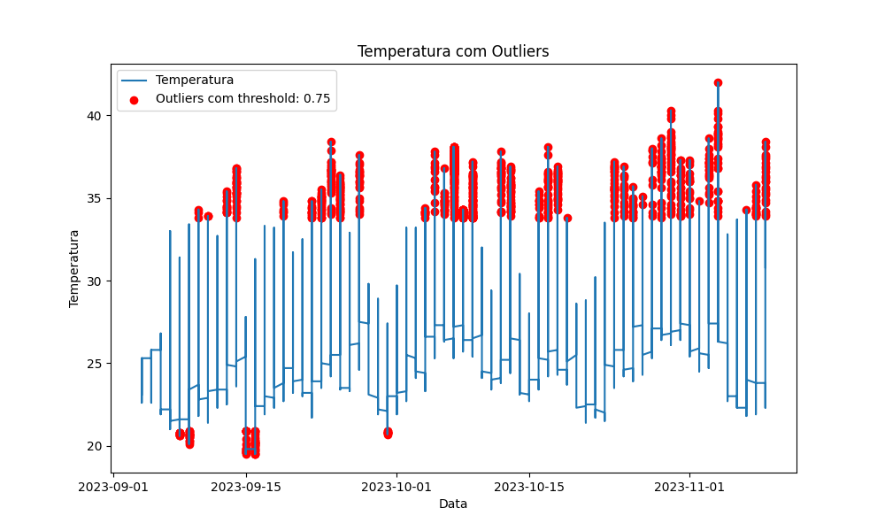
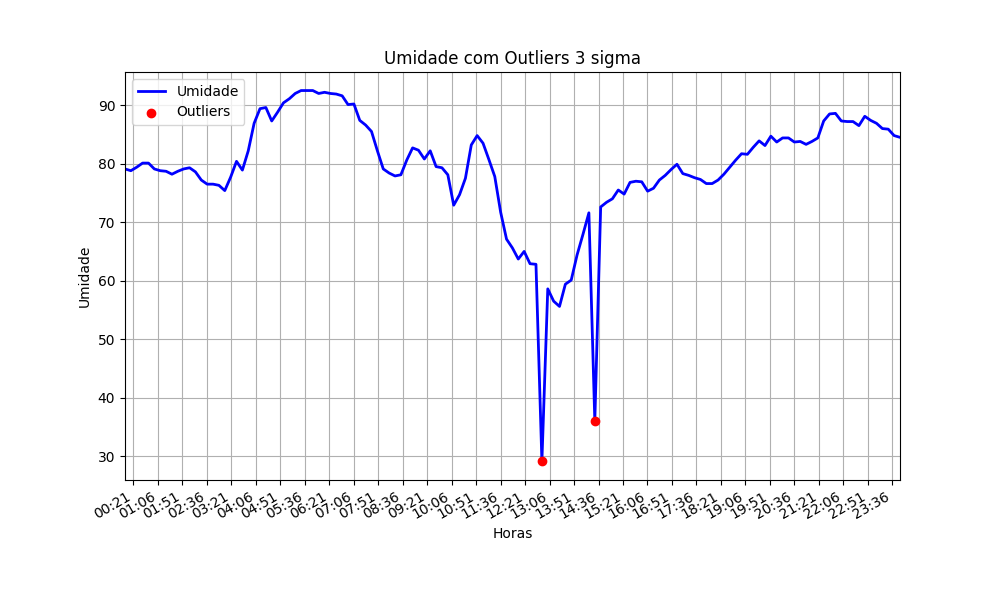
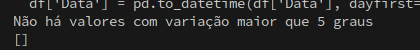

# Data error identifier

Scientific initiation project to identify errors in temperature, humidity and particulate matter sensors. 


## Documentation

[Based on Roberto M. Scheffel's research](https://journal-bcs.springeropen.com/articles/10.1186/s13173-019-0094-6)

[Outliers in a Smart Cities context](https://sciendo.com/article/10.2478/ijssis-2024-0004)

[ Three Sigma ](https://fastercapital.com/content/Outlier-detection--Detecting-Anomalies-with-Three-Sigma-Limits.html)

[GESD library](https://scikit-posthocs.readthedocs.io/en/latest/generated/scikit_posthocs.outliers_gesd.html)

## Features

- Overall graph
- Outlier error identifier using the IQR algorithm
- Outlier error identifier using the 3 sigma algorithm
- Spike/Peak error identifier 
- Stuck value identifier 
- High noise/Variance value identifier
- Generalized Extreme Studentized Deviate (GESD) identifier

## Results

### Overall graph
General graph using dataset values


### Outlier with IQR
The Interquartile Range (IQR) is a statistical measure that represents the spread of data in a dataset. It is calculated as the difference between the third quartile (Q3) and the first quartile (Q1):

\[ IQR = Q3 - Q1 \]

The calculation of IQR is done as follows:

```python
Q1 = temperature_column.quantile(0.25)
Q3 = temperature_column.quantile(0.75)
IQR = Q3 - Q1
```



### 3 Sigma Outlier
Three Sigma Limits are calculated using the mean value and the standard deviation of the data. The mean value is the average of all the data points, and the standard deviation measures how much the data points deviate from the mean.

```python
Upper_limit = (mean + 3 standard deviation)
Lower_limit = (mean - 3 standard deviation)
```


### Spike/Peak
The Peak Error function is utilized to detect spikes or outliers in a dataset based on the deviation from the mean. The calculation involves identifying values that exceed a certain threshold, which is determined by the multiplication of the standard deviation.

Where:
- `mean_temp` is the mean of the temperature column
- `std_temp` is the standard deviation of the temperature column
- `spike_threshold` is the threshold multiplier to identify spikes
- `spike_errors` is a subset of the temperature column containing values that deviate significantly from the mean.


### Stuck
The "Stuck" function is designed to identify sequences in a dataset where the values remain relatively constant over a specified window of time. This is determined by evaluating both the variance and mean of each sequence within the dataset.

Where:
- `tamanho_sequencia` is the size of the sequence window (set to 30)
- `threshold_variancia`is the threshold for the sequence variance (set to 0.25).

For each sequence in the dataset, the mean (`media_sequencia`) and variance (`variancia_sequencia`) are calculated. If the variance is below the specified threshold, and all values in the sequence fall within a range around the mean, the sequence is considered as "stuck," and its corresponding ID and mean are added to the `resultados` list.


### Variance
The "Variance" function aims to identify instances in a dataset where the temperature deviates by a specified threshold (5 degrees in this case) between consecutive time points. This is accomplished by comparing each current temperature with the next temperature in the sequence.

Where:
- `threshold` is the specified threshold for temperature deviation (set to 5 degrees)
- `vetor_ids ` is the list that stores the corresponding IDs when the temperature deviation exceeds the threshold.

For each time point in the dataset, the absolute difference (`diff`) between the current temperature (`temperatura_atual`) and the next temperature (`temperatura_proxima`) is calculated. If this difference exceeds the specified `threshold`, the corresponding ID is added to the `vetor_ids` list.

The function indicates that there are no values with a temperature difference of more than 5 degrees in the dataset.


